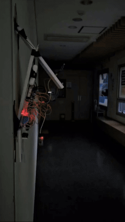

| 이미지 | 캡션 |
|--------|-------|
|    | Room 1st |
|  | Room 2nd |
|  | Sever by TCP/IP |
|  | Remote controller by stm32 |
|  | Choosing Room number for controling /   Presenting the brightness, temperature, humidity in the room.|
